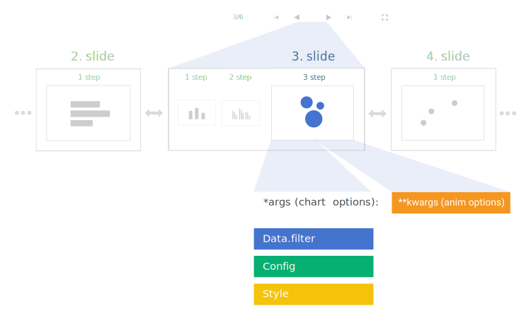

# Tutorial

This is an excellent starting point to get acquainted with `ipyvizzu-story`, as
it walks you through the installation and initialization of the extension,
introduces the logic it employs and the different settings to control how your
animated data stories look and behave.

The tutorial is organized into chapters that introduce the concept and the
details of `ipyvizzu-story` step-by-step. You can find the list of chapters at
the end of this page and in the menu.

Since `ipyvizzu-story` is built on top of
[ipyvizzu](https://github.com/vizzuhq/ipyvizzu), it's recommended that you learn
and understand `ipyvizzu` first. The tutorial for `ipyvizzu` can be found
[here](https://ipyvizzu.vizzuhq.com/latest/tutorial/).

## Basic logic of ipyvizzu-story

{ class='image-center' }

With `ipyvizzu-story`, you can build, show and export a `Story` object that
contains all of the data being shown throughout the story and the charts created
based on that data, arranged into `Slides` and `Steps`. When
played,`ipyvizzu-story` automatically adds a set of buttons underneath the
chart, via which the users can navigate between the `Slides` within the story.

`Slides` can contain one or more `Steps`.

A `Step` (and a single-Step `Slide`) is basically the same as the `Chart` object
in `ipyvizzu`, with some minor, but important differences (for now):

- all of the data has to be added to the story at initialization, and it can be
  filtered at every `Step` throughout the `Story`.
- animation options are not available

In case of a `Slide` with multiple `Steps`, all, but the last `Steps` are
interim charts that connect a `Slide` with a previous `Slide` but the animation
will not stop at these `Steps` when the `Story` is being played.

## Installation

```sh
pip install ipyvizzu-story
```

Visit [Installation chapter](../installation.md) for more options and details.

## Usage

!!! note
    `ipyvizzu-story` generates `JavaScript` code, then the `vizzu-story` and
    `vizzu` calls are evaluated by the browser. Therefore if a blank space
    appears where the chart should be, check the console log of your browser.
    `vizzu-story` and `vizzu` reports its errors there. If you get a
    `vizzu-story` or `vizzu` error in your browser console that is not
    straightforward to understand, please clean your browser cache first,
    because it might be caused by an older version being stored in your browser.
